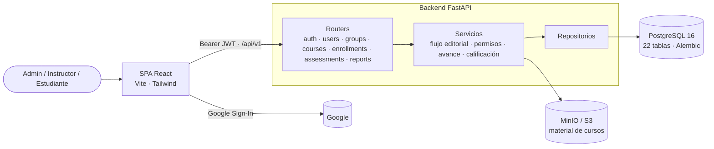

# MAEM Academy — plataforma de capacitación corporativa (LMS)

[](https://github.com/andres-en/MAEM_academy/actions/workflows/ci.yml)


*[Read in English](README.md)*

Sistema interno de gestión del aprendizaje para empresas: los instructores crean cursos de forma
colaborativa, los administradores los revisan y publican, los estudiantes se matriculan de forma
individual o por equipo, y cada lección, intento de evaluación y fecha límite queda registrada para
los reportes.

<!-- Capturas: agregar imágenes en docs/screenshots/ y descomentar.


-->

## Puntos destacados

- **Backend en capas.** Routers de FastAPI → servicios (reglas de negocio) → repositorios (consultas)
  → modelos SQLAlchemy 2, con esquemas Pydantic v2 en el borde. Las reglas de negocio nunca viven en
  los routers.
- **Flujo editorial como máquina de estados.** Los cursos pasan por
  `DRAFT → IN_REVIEW → (CHANGES_REQUESTED | APPROVED) → PUBLISHED → ARCHIVED`; cada transición
  verifica el rol de quien la pide y si es dueño o colaborador del curso, y queda en un log de
  auditoría.
- **Control de acceso por roles** con cuatro roles (`SUPERADMIN`, `ADMIN`, `INSTRUCTOR`, `USER`),
  aplicado por endpoint y por recurso (por ejemplo, un estudiante solo ve sus propias matrículas).
- **Motor de aprendizaje.** Matrículas por usuario o por grupo, módulos y lecciones ordenados,
  avance por lección, evaluaciones calificadas con nota mínima y límite de intentos, y fechas límite
  que pueden solo marcar o **bloquear** un curso vencido.
- **El historial nunca se pierde.** Los registros con historial académico están protegidos por
  llaves foráneas `RESTRICT`; intentar borrarlos devuelve un `409` claro y se ofrece desactivarlos.
- **Carga segura de archivos.** El material de los cursos va a un almacenamiento compatible con S3
  (MinIO en desarrollo). Se valida tamaño, extensión **y firma binaria (magic bytes)**, así que un
  archivo con extensión falsa se rechaza.
- **Carga masiva de usuarios** desde Excel con flujo validar → previsualizar → confirmar.
- **Esquema nativo de PostgreSQL.** 22 tablas con llaves UUID, migraciones con Alembic y un trigger
  que mantiene `updated_at` al día incluso en escrituras que no pasan por el ORM.
- **Autenticación.** El login de Google se intercambia por un JWT propio de la API de corta
  duración. Fuera de desarrollo, la API no arranca con un `JWT_SECRET` por defecto.

## Arquitectura



## Stack

| Capa | Tecnologías |
|---|---|
| Backend | Python 3.12, FastAPI, Pydantic v2, SQLAlchemy 2, Alembic |
| Datos | PostgreSQL 16 (llaves UUID, triggers), MinIO / S3 para archivos |
| Frontend | React 18, TypeScript, Vite, Tailwind CSS |
| Autenticación | Google Sign-In → JWT de la aplicación (HS256), control de acceso por roles |
| Calidad | pytest contra PostgreSQL real (con migraciones), ruff, verificación de OpenAPI |
| Entrega | Docker Compose, GitHub Actions |

## Cómo empezar

Requisitos: Docker y un client ID de Google OAuth (Google Cloud Console → Credenciales → ID de
cliente de OAuth, tipo "Aplicación web", con `http://localhost:2309` como origen de JavaScript
autorizado).

```bash
cp backend/.env.example backend/.env     # definir GOOGLE_CLIENT_ID y SUPERADMIN_EMAIL (tu cuenta de Google)
cp frontend/.env.example frontend/.env   # definir VITE_GOOGLE_CLIENT_ID (el mismo client ID)
docker compose up -d --build

docker compose exec backend alembic upgrade head
docker compose exec backend python -m app.scripts.seed_initial_data   # roles, categoría GENERAL, primer SUPERADMIN
```

| Servicio | URL |
|---|---|
| Frontend | <http://localhost:2309> |
| Documentación de la API (Swagger UI) | <http://localhost:8000/docs> |
| Adminer (explorador de la base) | <http://localhost:8080> |
| Consola de MinIO | <http://localhost:9001> |

Iniciar sesión en <http://localhost:2309/login> con la cuenta de Google definida en
`SUPERADMIN_EMAIL`.

Después de modificar modelos en `backend/app/models/`, crear la migración con
`docker compose exec backend alembic revision --autogenerate -m "descripción del cambio"`.

## Configuración

Configuración del backend (`backend/.env`, ver [backend/.env.example](backend/.env.example)):

| Variable | Descripción |
|---|---|
| `ENVIRONMENT` | `development` permite los secretos por defecto; cualquier otro valor no arranca con ellos |
| `DATABASE_URL` | URL de PostgreSQL (Compose la inyecta en el contenedor) |
| `JWT_SECRET` / `JWT_ALGORITHM` / `JWT_EXPIRE_MINUTES` | Configuración del token de la aplicación |
| `GOOGLE_CLIENT_ID` | Cliente de Google OAuth con el que se verifica el login |
| `CORS_ORIGINS` | Orígenes del frontend permitidos, separados por coma |
| `S3_ENDPOINT_URL` / `S3_PUBLIC_URL` / `S3_ACCESS_KEY` / `S3_SECRET_KEY` / `S3_BUCKET` | Almacenamiento de objetos para el material de los cursos |
| `MAX_UPLOAD_SIZE_MB` | Tamaño máximo de archivo |
| `SUPERADMIN_EMAIL` / `SUPERADMIN_NAME` | Primer administrador, creado por el script de seed |

Configuración del frontend (`frontend/.env`): `VITE_API_URL` y `VITE_GOOGLE_CLIENT_ID`.

## API

FastAPI genera la documentación interactiva en `/docs` (Swagger UI) y `/redoc`. Los endpoints viven
bajo `/api/v1`:

| Área | Endpoints |
|---|---|
| Auth | `POST /auth/google` (intercambia el token de Google por un JWT), `GET /auth/me` |
| Usuarios | CRUD, activar/desactivar, `GET /users/import/template`, `POST /users/import/validate`, `POST /users/import/confirm` |
| Grupos | CRUD, agregar/quitar miembros |
| Categorías | CRUD, activar/desactivar |
| Cursos | CRUD, imagen de portada, colaboradores, `submit-review`, `approve`, `request-changes`, `publish`, `archive` |
| Contenido | Módulos, lecciones y contenidos de lección (crear, editar, borrar, reordenar) |
| Matrículas | Asignar un curso a usuarios o grupos, listar matrículas, `GET /enrollments/me`, contenido del curso para el estudiante, completar una lección |
| Evaluaciones | Evaluaciones y preguntas por curso; iniciar y enviar intentos (se califican al enviar) |
| Reportes | Resumen de la plataforma, avance por curso, resumen de evaluaciones, historial por usuario |

## Pruebas

Los tests corren contra un **PostgreSQL real** con las migraciones de Alembic aplicadas, así que las
restricciones, los triggers y los UUID por defecto se comportan igual que en producción.

```bash
docker run -d --name maem-pg-test -e POSTGRES_PASSWORD=postgres -p 55432:5432 postgres:16-alpine
cd backend
pip install -r requirements-dev.txt
pytest --cov=app                          # TEST_DATABASE_URL apunta por defecto a localhost:55432
```

La suite cubre la autenticación y los permisos por rol, el flujo completo de revisión de cursos, el
recorrido del estudiante (matrícula → lecciones → intentos calificados → avance), las reglas de
administración (como los borrados que preservan el historial) y el esquema OpenAPI. El CI ejecuta
lint, los tests con un servicio PostgreSQL y los builds de Docker en cada push.

## Estructura del proyecto

```
backend/
├── app/
│   ├── api/v1/          # routers de FastAPI
│   ├── services/        # reglas de negocio (flujo editorial, permisos, calificación, importaciones)
│   ├── repositories/    # acceso a la base de datos
│   ├── models/          # modelos SQLAlchemy (22 tablas)
│   ├── schemas/         # modelos Pydantic de entrada y salida
│   ├── core/            # configuración, seguridad, almacenamiento, validación de archivos
│   └── scripts/         # datos iniciales
├── migrations/          # Alembic
└── tests/
frontend/                # SPA React + TypeScript
docs/                    # especificación funcional y modelo de datos
```

## Documentación

- [Especificación funcional](docs/specification.es.md): alcance, roles, flujos y reglas de negocio.
- [Modelo de datos](docs/data-model.es.md): entidades, relaciones y restricciones.

## Autor

**Andres Estepa** — [github.com/andres-en](https://github.com/andres-en)

## Licencia

© 2026 Andres Estepa. Todos los derechos reservados. El código se publica con fines de portafolio;
no se otorga licencia para usarlo, copiarlo, modificarlo ni distribuirlo.
