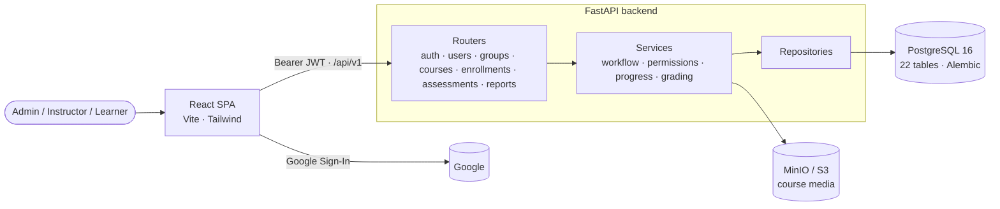

# MAEM Academy — corporate learning platform (LMS)

[](https://github.com/andres-en/MAEM_academy/actions/workflows/ci.yml)


*[Leer en español](README.es.md)*

An internal learning management system for companies: instructors author courses collaboratively,
admins review and publish them, learners are enrolled individually or by team, and every lesson,
quiz attempt and due date is tracked for reporting.

<!-- Screenshots: add images to docs/screenshots/ and uncomment.


-->

## Highlights

- **Clean layered backend.** FastAPI routers → services (business rules) → repositories (queries) →
  SQLAlchemy 2 models, with Pydantic v2 schemas at the edge. Business rules never live in the
  routers.
- **Editorial workflow as a state machine.** Courses move through
  `DRAFT → IN_REVIEW → (CHANGES_REQUESTED | APPROVED) → PUBLISHED → ARCHIVED`; each transition checks
  the caller's role and whether they own or collaborate on the course, and is written to an audit log.
- **Role-based access control** with four roles (`SUPERADMIN`, `ADMIN`, `INSTRUCTOR`, `USER`)
  enforced per endpoint and per resource (e.g. learners only see their own enrollments).
- **Learning engine.** Enrollments by user or by group, ordered modules and lessons, lesson
  completion and progress, graded assessments with a minimum score and attempt limits, and due dates
  that can either flag or **block** an overdue course.
- **History is never lost.** Records with academic history are protected by `RESTRICT` foreign keys;
  trying to delete them returns a clear `409`, and deactivation is offered instead.
- **Safe file uploads.** Course media goes to S3-compatible storage (MinIO in development). Files are
  checked by size, extension **and magic bytes**, so a file with a fake extension is rejected.
- **Bulk user import** from Excel with a validate → preview → confirm flow.
- **PostgreSQL-native schema.** 22 tables with UUID keys, Alembic migrations and a trigger that keeps
  `updated_at` current even for writes that bypass the ORM.
- **Auth.** Google Sign-In is exchanged for the API's own short-lived JWT. Outside development the API
  refuses to start with a default `JWT_SECRET`.

## Architecture



## Tech stack

| Layer | Technologies |
|---|---|
| Backend | Python 3.12, FastAPI, Pydantic v2, SQLAlchemy 2, Alembic |
| Data | PostgreSQL 16 (UUID keys, triggers), MinIO / S3 for files |
| Frontend | React 18, TypeScript, Vite, Tailwind CSS |
| Auth | Google Sign-In → application JWT (HS256), role-based access control |
| Quality | pytest against a real PostgreSQL (migrations applied), ruff, OpenAPI checks |
| Delivery | Docker Compose, GitHub Actions |

## Getting started

Requirements: Docker and a Google OAuth client ID (Google Cloud Console → Credentials → OAuth
client ID, type "Web application", with `http://localhost:2309` as an authorized JavaScript origin).

```bash
cp backend/.env.example backend/.env     # set GOOGLE_CLIENT_ID and SUPERADMIN_EMAIL (your Google account)
cp frontend/.env.example frontend/.env   # set VITE_GOOGLE_CLIENT_ID (same client ID)
docker compose up -d --build

docker compose exec backend alembic upgrade head
docker compose exec backend python -m app.scripts.seed_initial_data   # roles, GENERAL category, first SUPERADMIN
```

| Service | URL |
|---|---|
| Frontend | <http://localhost:2309> |
| API docs (Swagger UI) | <http://localhost:8000/docs> |
| Adminer (database browser) | <http://localhost:8080> |
| MinIO console | <http://localhost:9001> |

Sign in at <http://localhost:2309/login> with the Google account set in `SUPERADMIN_EMAIL`.

After changing models in `backend/app/models/`, create a migration with
`docker compose exec backend alembic revision --autogenerate -m "describe the change"`.

## Configuration

Backend settings (`backend/.env`, see [backend/.env.example](backend/.env.example)):

| Variable | Description |
|---|---|
| `ENVIRONMENT` | `development` allows the default secrets; any other value refuses to start with them |
| `DATABASE_URL` | PostgreSQL URL (Compose injects it into the container) |
| `JWT_SECRET` / `JWT_ALGORITHM` / `JWT_EXPIRE_MINUTES` | Application token settings |
| `GOOGLE_CLIENT_ID` | Google OAuth client used to verify the sign-in token |
| `CORS_ORIGINS` | Allowed frontend origins, comma-separated |
| `S3_ENDPOINT_URL` / `S3_PUBLIC_URL` / `S3_ACCESS_KEY` / `S3_SECRET_KEY` / `S3_BUCKET` | Object storage for course media |
| `MAX_UPLOAD_SIZE_MB` | Upload size limit |
| `SUPERADMIN_EMAIL` / `SUPERADMIN_NAME` | First administrator, created by the seed script |

Frontend settings (`frontend/.env`): `VITE_API_URL` and `VITE_GOOGLE_CLIENT_ID`.

## API

FastAPI generates the interactive documentation at `/docs` (Swagger UI) and `/redoc`. Endpoints live
under `/api/v1`:

| Area | Endpoints |
|---|---|
| Auth | `POST /auth/google` (exchanges the Google token for a JWT), `GET /auth/me` |
| Users | CRUD, activate/deactivate, `GET /users/import/template`, `POST /users/import/validate`, `POST /users/import/confirm` |
| Groups | CRUD, add/remove members |
| Categories | CRUD, activate/deactivate |
| Courses | CRUD, cover image, collaborators, `submit-review`, `approve`, `request-changes`, `publish`, `archive` |
| Content | Modules, lessons and lesson contents (create, update, delete, reorder) |
| Enrollments | Assign a course to users or groups, list enrollments, `GET /enrollments/me`, the learner's course content, complete a lesson |
| Assessments | Assessments and questions per course; start and submit attempts (graded on submit) |
| Reports | Platform summary, per-course progress, assessment summary, per-user history |

## Testing

The tests run against a **real PostgreSQL** with the Alembic migrations applied, so constraints,
triggers and UUID defaults behave exactly as in production.

```bash
docker run -d --name maem-pg-test -e POSTGRES_PASSWORD=postgres -p 55432:5432 postgres:16-alpine
cd backend
pip install -r requirements-dev.txt
pytest --cov=app                          # TEST_DATABASE_URL defaults to localhost:55432
```

The suite covers authentication and role enforcement, the full course review workflow, the learner
flow (enrollment → lessons → graded attempts → progress), admin rules (such as history-preserving
deletes) and the OpenAPI schema. CI runs lint, the tests with a PostgreSQL service and the Docker
builds on every push.

## Project structure

```
backend/
├── app/
│   ├── api/v1/          # FastAPI routers
│   ├── services/        # business rules (workflow, permissions, grading, imports)
│   ├── repositories/    # database access
│   ├── models/          # SQLAlchemy models (22 tables)
│   ├── schemas/         # Pydantic request/response models
│   ├── core/            # settings, security, storage, file validation
│   └── scripts/         # seed data
├── migrations/          # Alembic
└── tests/
frontend/                # React + TypeScript SPA
docs/                    # functional specification and data model
```

## Documentation

- [Functional specification](docs/specification.md) — scope, roles, workflows and business rules.
- [Data model](docs/data-model.md) — entities, relationships and constraints.

## Author

**Andres Estepa** — [github.com/andres-en](https://github.com/andres-en)

## License

© 2026 Andres Estepa. All rights reserved. The source code is published for portfolio purposes;
no license is granted to use, copy, modify or distribute it.
